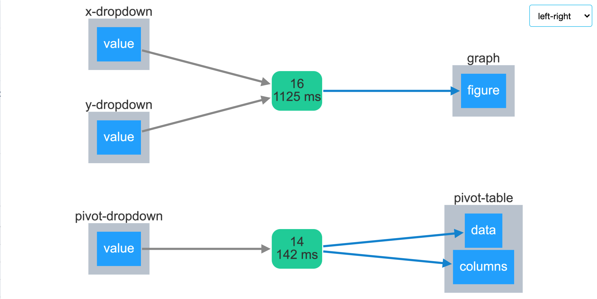

# dash-example-NBA

Live demo: https://dash-example-nba.herokuapp.com/

A web app hosted on heroku as an example to learn Dash

Ce dossier contient un exemple basique d'une application Dash. Le code
de l'application est dans le fichier `app.py`, le fichier `nba_physiques.csv`
contient les données.

Le jupyter notebook `NBA.ipynb` est un exemple de travail à réaliser en amont, 
avant de faire l'application, pour explorer les données et construire les
représentations graphiques.

## Modules python nécessaires

Pour installer Dash consulter la page relative à l'installation :
https://dash.plotly.com/installation

Pour une installation basique, depuis une ligne de commande, faire simplement :

    pip install dash

Pour les utilisateurs avancés, je vous conseilles de créer un environement 
dédié à l'application. Vous pouvez le créer à partir du fichier 
`environment.yml` contenu dans ce dossier, en l'important dans anaconda-navigator
ou depuis la ligne de commande :

    conda env create -f environment.yml

## Lancer l'application

Pour lancer l'application, depuis un terminal, exécuter la commande suivante :

    > python app.py
    Dash is running on http://127.0.0.1:8050/

    * Serving Flask app "app" (lazy loading)
    * Environment: production
    WARNING: This is a development server. Do not use it in a production deployment.
    Use a production WSGI server instead.
    * Debug mode: on

Dans votre navigateur, charger ensuite l'url http://127.0.0.1:8050/ (ou celle
qui s'affichera).

## contenu de l'application

L'application est divisée en deux parties :
* un graphique
* un tableau

Les deux menus déroulant au dessus du graphique contrôlent les variables portées
en abscisse et en ordonnées.

Le menu déroulant au dessus du tableau contrôle les valeurs qui sont regroupées
dans le tableau.

Ces deux actions sont réalisées grâce à deux fonctions (les `callback`). Voici
un schéma de ces callbacks.

La sélection des objets est réalisée grâce aux identifiants des éléments de la
page. Ils sont définis par les attributs `id` dans le code.
